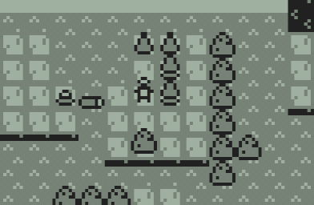
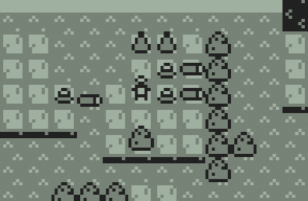
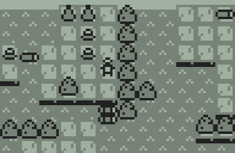

# MExp Raft Bug Branch

This is a branch for demonstrating a specific bug in MExp. This bug has since been fixed in the final release of the game.

## Send Files

First, you will need to send a couple files to your calculator. All of the files to send are in the `raft-bug` folder:

- `MEXP.8xk`: The MExp application. This is an old build of the game.
- `RSETSV.8xk`: A save file creation application. In the final release of MExp, this comes bundled with the main application, but at this point in development it was a separate application.
- `ME____.8xv`: The four parts of the world file. In the final release of MExp, these are all combined in one file: `MEXPWORL.8xv`.
    - At this point in development, the save file was also in four separate files! They are also of the format `ME____.8xv`.

Send all of these files to your calculator.

## Start the Game

After sending the files to your calculator:

1. Press `APPS`, and run the `RSETSV` application to generate a new save file.
2. Then, press `APPS` again, and run the `MEXP` application to start MExp.

## Recreate the Bug

To recreate the bug:

1. Knock down a tree to navigate to the second island of the map.

2. Find the two trees on this island that are on stumps, and push them to the right.

3. Push the two knocked-down trees downward to create a raft.

4. Press `[2ND]` to reset the island.

5. Repeat steps 2 through 4 again. If you've done everything right, the trees you used to make the raft should have mysteriously disappeared!

If you play around more, pushing logs, forming rafts, and resetting the island, you may eventually crash the game. Be very careful about doing this; you will lose all application data in your calculator's RAM, and could potentially corrupt other parts of your calculator if you're unlucky.
